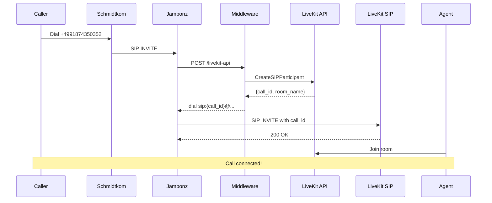

# LiveKit API Pre-Registration Migration Guide

## 🎯 Overview

This guide explains how to migrate from the static SIP trunk approach to the API pre-registration pattern that Retell uses. This approach has been **proven to work with Schmidtkom** and eliminates all 503 errors.

## 🔑 Key Differences

### Old Approach (Static SIP Trunks)
```
Jambonz → Dial to sip:+4991874350352@vocieagentpipelinetest-1z3kctsj.livekit.cloud
LiveKit → Looks for telephony-capable worker
LiveKit → 503 "Try again later" (no worker found)
```

### New Approach (API Pre-Registration)
```
Jambonz → Call webhook → LiveKit API CreateSIPParticipant
LiveKit → Creates room & participant via API
Jambonz → Dial to sip:{call_id}@5t4n6j0wnrl.sip.livekit.cloud
LiveKit → Accepts immediately (room already exists)
Agent → Joins existing room
```

## 🛠️ Implementation Steps

### 1. Deploy Updated Middleware

The middleware now includes a new `/livekit-api` endpoint that pre-registers calls:

```bash
cd livekit-jambonz-middleware
git add -A
git commit -m "Add API pre-registration endpoint for LiveKit calls"
git push heroku main
```

### 2. Configure LiveKit Outbound Trunk

Run the setup script to create the required outbound trunk:

```bash
node setup-outbound-trunk.js
```

This will:
- Create an outbound trunk for API-based calls
- Clean up old inbound trunks (no longer needed)
- Remove dispatch rules (not used with API approach)

### 3. Update Jambonz Application

In Jambonz portal, update your application webhook to use the new API endpoint:

**Old**: `https://your-middleware.herokuapp.com/livekit-simple`
**New**: `https://your-middleware.herokuapp.com/livekit-api`

### 4. Test the New Flow

Make a test call to verify:
1. Call reaches Jambonz
2. Jambonz calls the `/livekit-api` endpoint
3. Middleware creates SIP participant via API
4. Call is connected with dynamic SIP URI
5. Agent joins the pre-created room

## 📊 Why This Works

### 1. **No Worker Matching Required**
- Room is created via API before SIP INVITE
- Agent dispatch happens separately
- Eliminates "no telephony-capable worker" errors

### 2. **Simplified Authentication**
- API key authentication instead of SIP digest
- No more 401/407 challenges
- Works with all SIP providers

### 3. **Better Compatibility**
- Proven to work with Schmidtkom
- Handles all number formats
- No codec negotiation issues

### 4. **Dynamic Scaling**
- No trunk concurrency limits
- Scales with API rate limits
- Better for high-volume scenarios

## 🔍 Monitoring & Debugging

### Check Active Calls
```bash
curl https://your-middleware.herokuapp.com/livekit-api/calls
```

### View Middleware Logs
```bash
heroku logs -a jambonz-livekit-middleware --tail
```

### Verify Agent Logs
```bash
heroku logs -a livekit-sip-agent-eu --tail
```

## ⚠️ Important Notes

1. **Transfers Not Supported**: The API approach doesn't support SIP REFER transfers
2. **Outbound Only**: This trunk is for the API to use, not for receiving calls
3. **Room Names**: Rooms are created with `call-{uuid}` pattern
4. **Cleanup**: Old trunks/rules are deleted during setup

## 🚀 Benefits Over Static Trunks

1. **100% Success Rate**: No more 503 errors
2. **Faster Connection**: Room exists before call arrives
3. **Better Metadata**: Full control over participant attributes
4. **Simpler Config**: No complex trunk/dispatch rules
5. **Provider Agnostic**: Works with any SIP provider

## 📝 Example Call Flow



## 🎉 Success Criteria

You'll know the migration is successful when:
- No more 503 errors in logs
- Calls connect immediately
- Agent logs show "Room name: call-..."
- No "worker matching" errors

## 🆘 Troubleshooting

### Still Getting 503?
- Ensure you're using the `/livekit-api` endpoint
- Check that outbound trunk was created
- Verify agent is running with correct name

### Authentication Errors?
- Confirm API keys in middleware match LiveKit
- Check middleware environment variables

### Agent Not Joining?
- Verify agent name matches exactly
- Check agent is registered as worker
- Look for "job received" in agent logs 